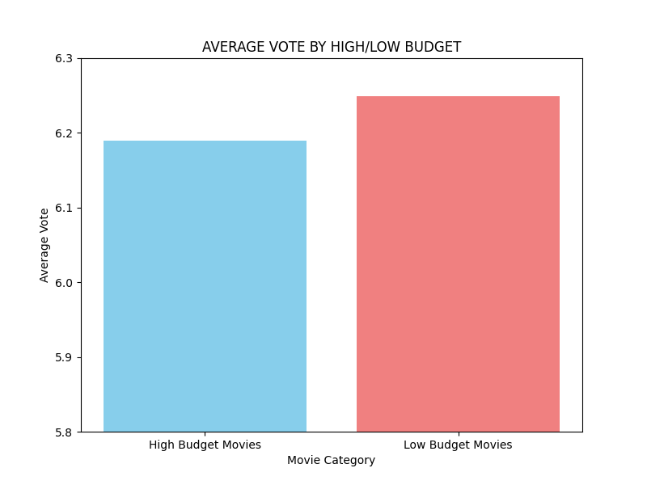

# TMDB Film Verisi Analizi

Bu proje, [TMDB 5000 Movies veri setini] kullanarak film süresi, bütçe, popülerlik ve vizyon yılı gibi faktörlerin ortalama oylamayı (rating) nasıl etkilediğini analiz eder.

## Proje Özeti
Bu çalışma, TMDB veri seti üzerinden filmlerin özellikleri ile izleyici puanları arasındaki ilişkileri incelemektedir. Amacı, "Daha uzun filmler mi daha çok beğenilir?" veya "Yüksek bütçe, yüksek puanı garanti eder mi?" gibi sorulara veri odaklı yanıtlar bulmaktır.
Veri temizleme, analiz ve görselleştirme işlemleri için Pandas, NumPy ve Matplotlib kütüphaneleri kullanılmıştır.

---

## Veri Temizleme
Analizin doğruluğunu sağlamak için, veri setinden öncelikle `homepage`, `keywords`, `tagline` gibi analiz dışı sütunlar kaldırılmıştır. Kalan veri setinde ise `runtime`, `budget` veya `popularity` gibi sütunlarda sıfır (0) ya da boş (NaN) değer içeren satırlar filtrelenerek analize uygun temiz bir veri seti elde edilmiştir.

---

## Temel Bulgular

Film süresi ile ortalama oy arasında dikkat çekici bir fark vardır.
Uzun filmler (180 dakika ve üzeri), genellikle daha yüksek oylara sahiptir.

Bütçe, izleyici puanlarını belirleyen birincil faktör değildir.
Düşük bütçeli filmler bile yüksek bütçeliler kadar iyi veya bazen daha yüksek puanlar alabilmektedir.

Popülerlik, genel olarak daha yüksek ortalama oylara katkı sağlar.
Popüler filmler, daha fazla izlenme oranıyla birlikte daha iyi izleyici geri bildirimi alır.

Vizyon yılı, puanlarda dönemsel bir değişim göstermektedir.
Eski dönem filmleri genellikle daha yüksek ortalama oylara sahipken, yeni dönem filmler biraz daha düşük oylarda kalmaktadır.

---

## Görseller ve Çıktılar

###      Film Süresi ve Ortalama Oy İlişkisi


###      Bütçe ve Ortalama Oy İlişkisi


###      Popülerlik ve Ortalama Oy İlişkisi


###      Vizyon Yılı ve Ortalama Oy İlişkisi


---

## Kullanılan Teknolojiler

| Kütüphane | Kullanım Amacı |
| :--- | :--- |
| **Pandas** | Veri okuma, temizleme ve manipülasyon |
| **NumPy** | Sayısal işlemler ve hesaplamalar |
| **Matplotlib** | Veri görselleştirme ve grafik oluşturma |

---

## Veri Seti Kaynağı

**TMDB 5000 Movies Dataset**

Veri dosyası bu depoda **`tmdb_5000_movies.csv`** adıyla yer almaktadır.  
Orijinal veri setine [Kaggle üzerinden ulaşabilirsiniz](https://www.kaggle.com/datasets/tmdb/tmdb-movie-metadata).

---

## Projeyi Çalıştırma

1. **Dosya Yapısı:**  
   `tmdb_5000_movies.csv` dosyası ile Python kodunuz (`tmdb_film_projesi.py`) **aynı klasörde** olmalıdır.

2. **Kütüphane Kurulumu:**  
   Projenin çalışması için gerekli kütüphaneleri yükleyin:
   ```bash
   pip install pandas numpy matplotlib

##  Geliştirici ve İletişim

Bu proje, **Tuğba Demir** tarafından geliştirilmiştir.
* **E-posta:** **demirtugba490@gmail.com**

---


